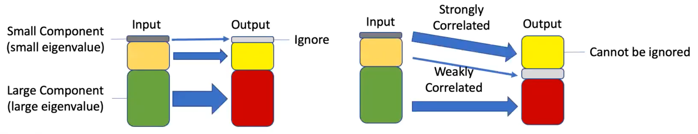

```{r, load_refs, echo=FALSE, cache=FALSE, message=FALSE}
library(RefManageR)
BibOptions(check.entries = FALSE, 
           bib.style = "authoryear", 
           cite.style = 'authoryear', 
           style = "markdown",
           hyperlink = FALSE, 
           dashed = FALSE)
myBib <- ReadBib("assets/example.bib", check = FALSE)
top_icon = function(x) {
  icons::icon_style(
    icons::fontawesome(x),
    position = "fixed", top = 10, right = 10
  )
}
```

## Overview
* Background/Motivation

* PLS Algorithm

* Toy Example

* Sports Example

---

## Background

* Partial Least Squares or projection to latent structures is a collection of regression based method designed for the analysis of high dimensional data in a low-structure environment. 

* Developed by econometrician Herman Wold in the late sixties

* Has use in many disciplines including bioinformatics, economics, social science, and **chemometrics**

* Many different variations exist:
.pull-left[
* PLS-W2A
* PLS1
* PLS2
* PLS-SVD
* Mode B PLS (Canonical Correlation Analysis)
* PLS-R
* PLS-DA
* PLS-PM
  ]
.pull-right[
* PLS-SEM
* OPLS
* L-PLS
* SPLS
* Nonlinear Iterative Partial Least Squares (NIPALS)
* SIMPLS
* KernalPLS
]

???

Presenter Notes

PLS-DA = Discriminant Analysis  
PLS-PM = Path Modeling  
PLS-SEM = Squares Path Modeling  
OPLS = Orthogonal Projections to Latent Structures  
SPLS = Sparse Partial Least Squares  

---

## Motivation

* The goal of PLS regression is to predict Y from X and describe their common structure.
* When $Y$ is a vector and $X$ is full rank this can be solved by MLR
* However problems with this arise when $X$ is likely to be singular
  * when the number of predictors/features is large compared to the number of observations 
  * when multicollinearity exists (feature matrix $X$ has less than full rank)  
[For detailed explanation see chapter 3](https://users.cecs.anu.edu.au/~kee/pls.pdf)
---

## What is PLS

* Partial Least Squares (PLS) is a multivariate regression method
* The goal of PLS is to find a low-dimensional representation of the input data that captures the maximum covariance between the input and output variables
* PLS works by iteratively extracting pairs of latent variables or "components" that capture the maximum covariance between the input and output variables
* These components are then used to build a linear regression model
* PLS is a useful method for high-dimensional data with many predictor variables
* PLS can handle multicollinearity and non-linearity in the relationships between the predictor and response variables

---

## Latent Modeling 




---

## PCR vs PLS

* PCR uses the $X$-information to build components
  * Choose basis vectors from low dimensional project that maximize variation of X
  $$\max\mathrm{Var}(X)$$
* PLS uses the $X$ and $Y$ information to build components by looking at the cross-covariance of $X$ and $Y$
  $$\max\mathrm{Cov}(X,Y)$$
* PLS and PCR often predict with similar performance & level of error
* PLS generally able to predict with fewer components  

---

## Visulization of PLS


---

## Visulization of PLS


---

## PLS Algorithm

Let $X \in \mathbb{R}^{n \times d}$ and $Y \in \mathbb{R}^{n \times t}$ be centered matrices, and $K$ is the number of components. Then for each $k \in [1, K]$:

1. Compute the first pair of singular vectors $X_k^T Y_k$. $u_k \in \mathbb{R}^d$ and $v_k \in \mathbb{R}^t$, the first left and right singular vectors of the cross-covariance matrix $C = X_k^T Y_k$.  

  1A.  Note $u_k$ and $v_k$ are weights that maximize the covariance between the $X_k$ and $\text{Cov}(X_k u_k, Y_k v_k)$  

2. Project $X_k$ and $Y_k$ on the singular vectors obtaining the scores $\xi_k = X_k u_k$ and $\omega_k = Y_k v_k$  

3. Obtain the rank-one approximations of the data matrices (loading vectors): 

  3A. Regress $X_k$ on $\xi_k$ to get $\gamma_k^T = (\xi_k^T \xi_k)^{-1}\, \xi_k^T X_k$  
  
  3B. Regress $Y_k$ on $\omega_k$ to get $\delta^T = (\omega_k^T \omega_k)^{-1}\, \omega_k^T Y_k$  

---

## PLS Algorithm Continued
  
<span>4.</span> Deflate $X_k$ and $Y_k$ by subtracting the rank-one approximations:   

&nbsp; &nbsp; 4A. $X_{k+1} = X_k - \xi_k \gamma_k^T$  
  
&nbsp; &nbsp; 4B. $Y_{k + 1} = Y_k - \omega_k \delta_k^T$  
  
<span>5.</span> If $X_{k+1}^T Y_{k + 1} = 0$  

&nbsp; &nbsp; 5A. $K \leftarrow k$ (Note this is the rank or dimension of the PLS model)  

&nbsp; &nbsp; 5B. Stop/Exit loop  

Else continue.  
  
<span>6.</span> $k \leftarrow k+1$  

<span>7.</span> Return to step 1

---

## Test 1
1. Compute the first pair of singular vectors $u_1$ and $v_1$ by computing the SVD of the cross-covariance matrix $C = X^T Y$. Here, $u_1$ and $v_1$ are the weights that maximize the covariance between the input and output variables, subject to the constraint that they are normalized.
2. Project the input and output data matrices onto the first pair of singular vectors to obtain the scores $\xi_1 = X u_1$ and $\omega_1 = Y v_1$.
3. Compute the rank-one approximations of the input and output data matrices by regressing $X$ and $Y$ onto $\xi_1$ and $\omega_1$, respectively. This gives the loading vectors $\gamma_1$ and $\delta_1$:
    * $\gamma_1^T = (\xi_1^T \xi_1)^{-1}, \xi_1^T X$
    * $\delta_1^T = (\omega_1^T \omega_1)^{-1}, \omega_1^T Y$
4. Deflate the input and output data matrices by subtracting the rank-one approximations:
    * $X_1 = X - \xi_1 \gamma_1^T$
    * $Y_1 = Y - \omega_1 \delta_1^T$

---

## Test 2

5. Repeat steps 1-4 for $K$ components, where $K$ is a user-specified parameter. At each iteration, the algorithm extracts the next pair of singular vectors that captures the maximum covariance between the residual input and output matrices.
6. The algorithm terminates when the rank of the cross-covariance matrix $C$ reaches $K$, or when $X_k^T Y_k = 0$ for some $k$, indicating that there is no more covariance to extract.
7. The final PLS model is given by the sum of the rank-one approximations:
    * $\hat{Y} = \sum_{k=1}^K \xi_k \delta_k^T$

---


## PLS Kernel Algorithm 

```{r}

```

---

## Results of the method


---

## Code Review


---

## Data tables `r top_icon("table")`

.font80[
```{r, message = FALSE}
library("DT"); library("dplyr")
iris %>% 
  DT::datatable(class = "compact", rownames = FALSE, extensions = "Buttons",
                options = list(dom = 'tBp', buttons = c("csv","excel"), 
                               pageLength = 8)) %>% 
  DT::formatRound(1:4, digits = 1) 
```
]

---

## FAQ `r top_icon("question-circle")`

<blockquote>
How do I start a new slide? 
</blockquote>

Using three dashes at the start of a new line <code>---</code>

--

<blockquote>
I have three dashes but it's not starting a new slide.  
</blockquote>

The three dashes need to be on their own line with **no spaces after them**

--

<blockquote>
I'm giving my presentation but the text is too small. HELP!
</blockquote>

By default remark.js disables browser based zooming. I've found and modified a hack to re-enable it, but it's not perfect. [`remark-zoom.js`](https://github.com/William-Yeh/remark-zoom) I'm also open to increasing the default font size - need to test it out on a range of displays.

---
class: center, middle

# Text adjustments

It is also possible to change the .blue[color] of any text by using `.color[text here]`

--

For example `.grey[grey]` will make text .grey[grey].

--

We can do this with white, .brand-red[Sydney master brand red], .brand-blue[Sydney master brand blue], .brand-yellow[Sydney master brand yellow], .brand-charcoal[Sydney master brand charcoal], .brand-grey[Sydney master brand grey], .black[black], .red[red], .blue[blue], .green[green], .yellow[yellow], .orange[orange], .purple[purple], .grey[grey].

--

To make text stand out we can use standard markdown `**text**` like **this** 
or `.bold[this]` .bold[this].  Or italics using `_italic_` _italic_.

You can string together these formats, e.g. `.blue[.bold[...]]` 
to get .blue[.bold[blue and bold text]].

--

.left[.footnote[The text on this slide is centered and in the middle of the slide because the slide began with:
```
---
class: center, middle
```

]]

---
class: vt-chicago-marroon

## Two columns! `r top_icon("columns")`

.pull-left[

### Some things on the left

1. List of things;

1. Plain Markdown;

1. blah blah; and

1. Plain Markdown

]

--

.pull-right[

### and other things on the right

We do this by using the `.pull-left[]` and `.pull-right[]` commands. Just put any text inside the  brackets and you're good to go

]

Code below (or above) these two has no problem extending the full width of the slide.

.footnote[The background of this slide is Sydney University Yellow because the slide began with:
```
---
class: sydney-yellow
```
]

---

## R code and highlighting `r top_icon("r-project")`

.pull-left[
An example using a leading `*`:

```r
if (TRUE) {
** message("Very important!")
}
```
Output:
```r
if (TRUE) {
* message("Very important!")
}
```

This is invalid R code, so it is a plain fenced code block that is not executed.
]

.pull-right[
An example using `{{}}`:

`r ''````{r tidy=FALSE}
if (TRUE) {
*{{ message("Very important!") }}
}
```
Output:
```{r tidy=FALSE}
if (TRUE) {
{{ message("Very important!") }}
}
```

It is valid R code so you can run it.
]


---

## R code and plot output `r top_icon("r-project")`

```{r, fig.height=4.5, fig.width=12, fig.retina=2, fig.align='center', message=FALSE, warning=FALSE}
library("tidyverse")
cars %>% 
ggplot(aes(x = dist, y = speed)) + 
geom_point() + 
{{ geom_smooth(method = 'lm', # highlighted using {{...}}
formula = y ~ poly(x, 2))}} + 
theme_bw(base_size = 24) + 
labs(y = "Speed (mph)", x = "Stopping distance (ft)")
```

---

## Font sizes

.pull-left[

.pull-left[
.font10[.font10]
.font20[.font20]
.font30[.font30]
.font40[.font40]
.font50[.font50]
.font60[.font60]
.font70[.font70]
.font80[.font80]
.font90[.font90]
Standard
.font110[.font110]
.font120[.font120]
.font130[.font130]
.font140[.font140]
.font150[.font150]
.font160[.font160]
.font170[.font170]
.font180[.font180]
.font190[.font190]
.font200[.font200]

]

.pull-right[

.code10[`.code10[]`]
.code20[`.code20[]`]
.code30[`.code30[]`]
.code40[`.code40[]`]
.code50[`.code50[]`]
.code60[`.code60[]`]
.code70[`.code70[]`]
.code80[`.code80[]`]
.code90[`.code90[]`]
`standard`
.code110[`.code110[]`]
.code120[`.code120[]`]
.code130[`.code130[]`]
.code140[`.code140[]`]
.code150[`.code150[]`]
.code160[`.code160[]`]
.code170[`.code170[]`]
.code180[`.code180[]`]
.code190[`.code190[]`]
.code200[`.code200[]`]

]

]

.pull-right[

I've also enabled an alternate approach, that operates on all text: inline code, code chunks and regular text.

.Large[.Large `.Large[]` 144%]

.large[.large `.large[]` 120%]

.small[.small `.small[]` 90%]

.footnotesize[.footnotesize `.footnotesize[]` 80%] 

.scriptsize[.scriptsize `.scriptsize[]` 70%] 

.tiny[.tiny `.tiny[]` 60%]

]


---

## Font sizes

This is normal sized and coloured text. With a normal size code and output:

```{r}
rnorm(2)
```

.blue[.small[This blue text is in a `.blue[.small[...]]` chunk. Everything is shrunk to 90% including the `inline code` as well as code chunks and their output:

```{r}
rnorm(2)
```

]]

---
class: columns-2

## Equations


MathJax is supported out of the box.  You can put inline equations inside dollar signs, e.g. `$\alpha + \beta$` renders as $\alpha + \beta$.   Display style works with double dollar signs: 

<span>`$`</span><span>`$`</span>`\bar{X} = \frac{1}{n} \sum_{i=1}^n X_i`<span>`$`</span><span>`$`</span>
$$\bar{X} = \frac{1}{n}\sum_{i=1}^n X_i$$
For multi-line equations you can use <span>`\`</span>`begin{align} ...  `</span>`\`</span>`end{align}`
\begin{align}
\bar{X} & = X_1 + X_2 + \ldots + X_n \nonumber \\
& = \frac{1}{n}\sum_{i=1}^nX_i \label{good-eq}
\end{align}
Note the equation number! We can reference it in the usual way, using <span>`\`</span>`eqref{label}`, \eqref{good-eq}, or <span>`\`</span>`ref{label}`, \ref{good-eq}.

---

## Equation numbering

Equation numbering isn't part of the standard xaringan package but I've included it with the theme.  This is enabled with the inclusion of the `in_header` line in the YAML with reference to the file `mathjax-equation-numbers.html` which needs to be in an appropriate location.

```
output:
xaringan::moon_reader:
includes:
*      in_header: "assets/mathjax-equation-numbers.html"
```

---

## Central limit theorem 


Let $X_{1}, X_{2},\ldots$ be independent random variables with characteristic functions $\phi_{1},\phi_{2},\ldots$ and distribution functions $F_{1},F_{2},\ldots$ and let $\mathbb{E} X_{i}=0$ and $\mathbb{E} X_{i}^{2}=\sigma_{i}^{2}<\infty$, $i=1,2,\ldots$.

Write $S_{n} = \sum_{i=1}^{n}X_{i}$ and $s_{n}=\textrm{Var}(S_{n}) = \sum_{i=1}^{n}\sigma^{2}_{i}$.  Let
\begin{align}
L_{n}(\varepsilon) & = s^{-2}_{n}\sum_{i=1}^{n}\mathbb{E}\big[ X_{i}^{2}\mathbb{I}\big(|X_{i}|>\varepsilon s_{n}\big)\big] \nonumber \\
& = s_{n}^{-2}\sum_{i=1}^{n}\int_{|x|>\varepsilon s_{n}}x^{2}\operatorname{d}F_{n}(x)
\end{align}
The _Lindeberg condition_ states:
$$\begin{equation}\text{for all } \varepsilon>0,\ L_{n}(\varepsilon)\rightarrow0 \text{ as }n\rightarrow\infty.\label{LindCond}\end{equation}$$
If $\mathbb{E}|X_{1}|^{3}<\infty$ and $s_{n}^{-3}\sum_{i=1}^{n}\mathbb{E}|X_{i}^{3}|\rightarrow 0$ as $n\rightarrow\infty$ then Lindeberg's condition holds.  This condition under which the Lindeberg's condition holds is known as Liapounov's condition \eqref{LindCond}.


---

# Tables

.pull-left[

- Tables are centered by default in **xaringan**. 
- We can override this using `.pull-left[]` and 
`.pull-right[]`


|  This |  is |   a    |    table     |
| :---- | :-- | -----: | :----------: |
| It is | now | pulled | to the left  |
| 12    | 34  | 56     |      78      |

]

.pull-right[
```{r, eval = FALSE}
knitr::kable(iris[1:10, 1:4], 
format = "html")
```
.small[
```{r, echo = FALSE}
colnames(iris) = gsub(pattern = "\\.",
replacement = " ", 
colnames(iris))
knitr::kable(iris[1:10, 1:4], format = "html")
```
]
]
